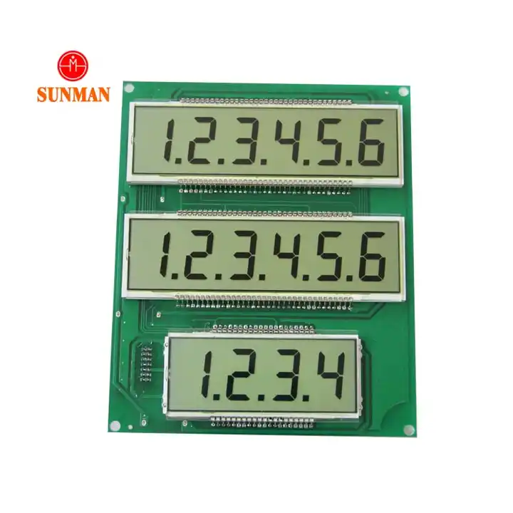

# LT-3XS664

This is a library for the LT-3XS664(595) display, which has three rows with six, six, and four slots, respectively.



## Usage

```c++
#include <Arduino.h>
#include <Display.h>

Display display(LCD_ENABLE_PIN, LCD_CLK_PIN, LCD_DATA_PIN);

void setup() {
  // put your setup code here, to run once:
  Serial.begin(115200);  //setup COMport baudrate
  display.setup();
  display.cls();

  //any type of same arguments canbe pass
  display.printLines(200,350,5);
  delay(5000);

  //pass any type arguments to each display row and all text align is right.
  display.printFirstLine(67000);
  display.printSecondLine("Press");
  display.printThirdLine(5.6);
  delay(5000);

  //pass char string arguments to each display row and all text align is left.
  display.printFirstRow("H.I.");
  display.printSecondRow("P.A.Y.");
  display.printThirdRow("E.VM...");
  delay(5000);
}


void loop() {
  ;
}
```
